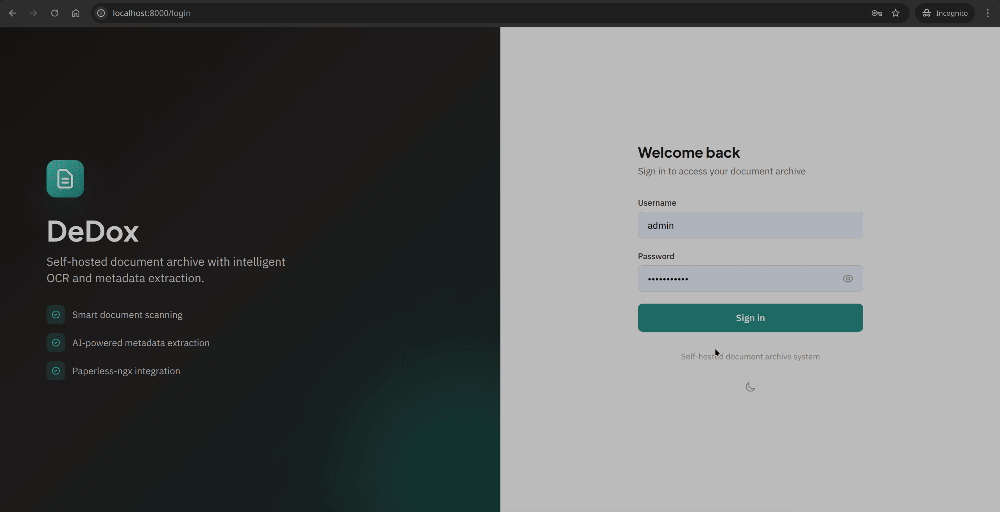
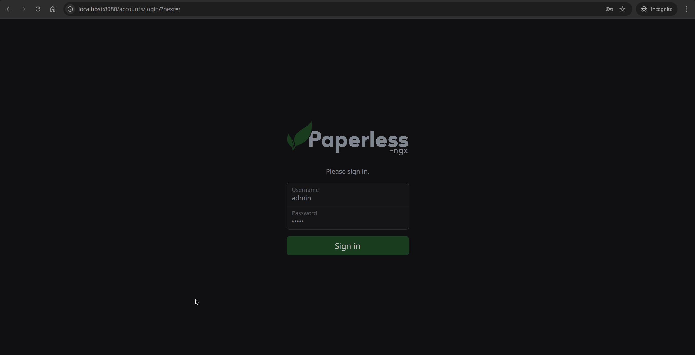
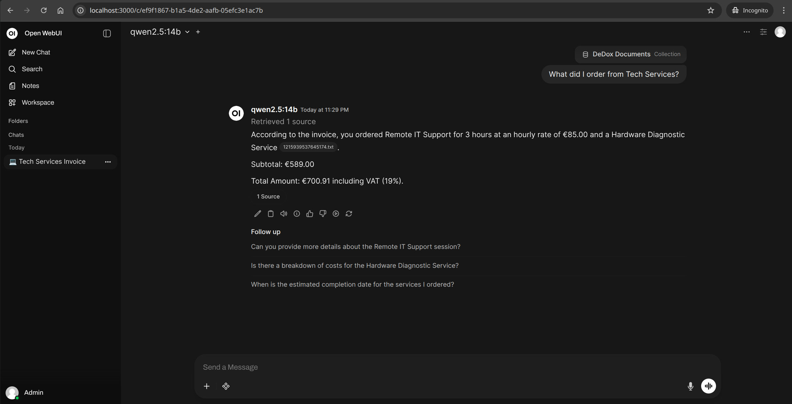

# DeDox - Detoxify Your Document Chaos

[](https://github.com/bytecube/dedox/actions/workflows/test.yml)
[](https://github.com/bytecube/dedox/actions/workflows/docker.yml)
[](https://www.python.org/downloads/)
[](https://opensource.org/licenses/Apache-2.0)
[](https://www.docker.com/)

> **Alpha Release Notice**: This project was developed using AI-assisted "vibe coding" methodology with [Claude](https://www.anthropic.com/claude) (Opus 4.5) by Anthropic. While functional and tested, users should evaluate suitability for their use case. **Use at your own risk.**

**DeDox** = *de* (undo, remove) + *dox* (documents) — detoxify your paperwork by transforming chaotic piles of documents into organized, searchable, AI-enhanced archives.

A self-hosted, privacy-first document ingestion service that captures, processes, extracts metadata, and archives documents to Paperless-ngx.

## See It In Action

### 📱 Capture & Process
Scan documents with your phone using live edge detection, then watch DeDox automatically extract metadata via local LLM.

<p align="center">
  
  &nbsp;&nbsp;&nbsp;
  
</p>

### 📦 Archive & Search
Documents are enriched with AI-extracted metadata in Paperless-ngx, then synced to Open WebUI for RAG-powered chat.

<p align="center">
  
  &nbsp;&nbsp;&nbsp;
  
</p>

## 100% Local - Zero Internet Required

**Your documents never leave your network.** DeDox is designed from the ground up to operate entirely within your local network:

- **No cloud dependencies**: All processing happens on your hardware
- **No external API calls**: LLM inference runs locally via Ollama
- **No telemetry or tracking**: Your data stays yours
- **Air-gapped compatible**: Works without any internet connection
- **Mobile app**: Connects only via local network (LAN/WiFi) — no internet traffic, no external servers

This makes DeDox ideal for sensitive documents like financial records, medical documents, legal paperwork, and personal correspondence.

## Modular Architecture

DeDox integrates with external services via their APIs, making each component **completely independent and optional**:

| Component | Purpose | Required? |
|-----------|---------|-----------|
| **DeDox** | Document processing, OCR, metadata extraction | Yes (core) |
| **Paperless-ngx** | Document storage and archive | Yes |
| **Ollama** | Local LLM for metadata extraction | Yes |
| **Open WebUI** | RAG-powered chat with documents | **Optional** |

### Why This Matters

- **Use existing instances**: Already running Paperless-ngx or Open WebUI on your home network? Point DeDox at them — no need to run duplicates
- **Mix and match**: Don't need AI chat? Disable Open WebUI sync entirely in `config/settings.yaml`
- **Upgrade independently**: Each service can be updated, scaled, or replaced without affecting others
- **Resource flexibility**: Running on limited hardware? Skip Open WebUI and still get full document processing

```yaml
# config/settings.yaml - Disable Open WebUI if not needed
openwebui:
  enabled: false  # Simply disable if you don't need RAG chat
```

## Features

- 📷 **Phone Camera Capture**: Live edge detection, perspective correction, multi-page scanning — all via local WiFi, no internet
- 🔍 **OCR Processing**: Tesseract-based text extraction (German/English) running locally
- 🤖 **AI Metadata Extraction**: Local LLM-powered extraction of dates, amounts, types, urgency via Ollama
- 🔐 **Privacy First**: Zero cloud dependencies, zero external API calls, runs entirely on your local network
- 📦 **Paperless-ngx Integration**: Seamless archival with full metadata mapping (works with existing instances)
- 💬 **Open WebUI RAG** *(optional)*: Chat with your documents using semantic search and AI-powered Q&A
- ⚙️ **Extensible Pipeline**: Configurable processing stages and metadata fields
- 🔌 **API-First Design**: All integrations via standard APIs — plug into your existing infrastructure

## Architecture

All components communicate via standard REST APIs over your local network — **no internet required**.

```
┌─────────────────────────────────────────────────────────────────────┐
│                    Local Network (No Internet)                       │
├─────────────────────────────────────────────────────────────────────┤
│                                                                      │
│  ┌──────────────┐                                                   │
│  │  Mobile App  │ ◀──── WiFi/LAN only, no internet traffic          │
│  └──────┬───────┘                                                   │
│         │                                                            │
│         ▼                                                            │
│  ┌─────────────────┐    ┌─────────────────┐    ┌─────────────────┐  │
│  │   DeDox Web UI  │───▶│  DeDox API      │───▶│ Paperless-ngx   │  │
│  │   (Frontend)    │    │  (Python)       │    │ (existing or new)│  │
│  └─────────────────┘    └────────┬────────┘    └────────┬────────┘  │
│                                  │                       │           │
│                    ┌─────────────┼───────────────────────┤           │
│                    │             │                       │           │
│              ┌──────────┐  ┌─────▼──────┐        ┌──────▼──────┐    │
│              │ Tesseract│  │   Ollama   │        │  Open WebUI │    │
│              │   OCR    │  │    LLM     │◀───────│  (optional) │    │
│              └──────────┘  └────────────┘        └─────────────┘    │
│                                                                      │
│  API-Based Integration:                                              │
│  • Each component is independent and communicates via REST APIs     │
│  • Use existing Paperless-ngx/Open WebUI instances on your network  │
│  • Remove or disable any optional component without breaking others  │
└─────────────────────────────────────────────────────────────────────┘
```

## Quick Start

### Prerequisites

- Docker & Docker Compose
- 8GB+ RAM recommended (for local LLM)

### Installation

1. Clone the repository:
   ```bash
   git clone <repository-url>
   cd dedox
   ```

2. Copy and configure environment:
   ```bash
   cp .env.example .env
   # Edit .env with your settings
   ```

3. Start all services:
   ```bash
   docker-compose up -d
   ```

4. Access the services:
   - **DeDox API**: `http://localhost:8000`
   - **Paperless-ngx**: `http://localhost:8080`
   - **Open WebUI**: `http://localhost:3000`

That's it! DeDox automatically handles:
- Paperless-ngx API token generation
- Open WebUI API key generation
- Knowledge base creation
- Workflow setup

## Configuration

Configuration files are located in `config/`:

- `settings.yaml` - Main application settings
- `metadata_fields.yaml` - Configurable metadata extraction fields
- `document_types.yaml` - Document type definitions
- `urgency_rules.yaml` - Urgency calculation rules

## API Documentation

Once running, access the API documentation at:
- Swagger UI: `http://localhost:8000/docs`
- ReDoc: `http://localhost:8000/redoc`

## Processing Workflows

### DeDox Processing Pipeline (Triggered by `dedox:reprocess` tag)

1. **Ingest** → Store original, return job ID
2. **Image Processing** → Edge detection, alignment, enhancement
3. **OCR** → Text extraction with Tesseract
4. **Upload to Paperless** → Archive processed document with "Processing..." tag
5. **Metadata Extraction** → LLM-based field extraction
6. **Finalize** → Update Paperless metadata, remove processing tag

### Open WebUI Sync (Triggered by any Paperless document update)

1. **Document Updated** → Paperless webhook fires
2. **Download** → Fetch document and metadata from Paperless
3. **Upload** → Send to Open WebUI for processing
4. **Process** → Open WebUI extracts embeddings
5. **Index** → Add to knowledge base for RAG chat

## Paperless Webhook Configuration

DeDox uses two separate webhooks for different purposes:

### Workflow 1: DeDox Processing (OCR + Metadata Extraction)

**Purpose**: Trigger DeDox pipeline for OCR and LLM-based metadata extraction

**Setup in Paperless**:
1. Go to Workflows in Paperless admin
2. Create new workflow:
   - **Trigger**: Document Updated
   - **Filter**: Tags contain `dedox:reprocess`
   - **Action**: Webhook
   - **URL**: `http://dedox:8000/api/webhooks/paperless/document-updated`
   - **Method**: POST

### Workflow 2: Open WebUI Sync (Document RAG)

**Purpose**: Sync ALL document updates to Open WebUI for semantic search

**Setup in Paperless**:
1. Go to Workflows in Paperless admin
2. Create new workflow:
   - **Trigger**: Document Updated
   - **Filter**: (None - trigger on ALL updates)
   - **Action**: Webhook
   - **URL**: `http://dedox:8000/api/webhooks/paperless/document-sync`
   - **Method**: POST

**Note**: These workflows are independent. Reprocessing a document will trigger both: first the DeDox processing pipeline, then when metadata is updated back to Paperless, the sync webhook fires and updates Open WebUI.

## Open WebUI Configuration

Open WebUI settings can be configured in `config/settings.yaml`:

```yaml
openwebui:
  enabled: true                        # Enable/disable sync
  base_url: "http://open-webui:8080"   # Internal API URL
  frontend_port: 3000                  # External access port
  api_key: "${DEDOX_OPENWEBUI_API_KEY:}"
  knowledge_base_id: "dedox-documents"
  auto_create_knowledge_base: true
  timeout_seconds: 60
  wait_for_processing: true
  max_processing_wait: 300
```

To disable Open WebUI sync temporarily, set `enabled: false` in the config.

## Development

```bash
# Create virtual environment
python -m venv venv
source venv/bin/activate

# Install dependencies
pip install -r requirements.txt

# Run development server
uvicorn dedox.api.app:app --reload --port 8000
```

## Running with Docker

### Full Stack (fresh installation)
```bash
docker-compose up -d
```

### Connect to Existing Services

Already have Paperless-ngx or Open WebUI running on your network? Connect DeDox to your existing infrastructure:

```bash
# Configure existing service URLs in .env
DEDOX_PAPERLESS_URL=http://your-paperless-server:8000
DEDOX_PAPERLESS_TOKEN=your-existing-token
DEDOX_OPENWEBUI_URL=http://your-openwebui-server:3000  # optional

# Run minimal DeDox (without bundled Paperless/Open WebUI)
docker-compose -f docker-compose.minimal.yml up -d
```

### Without Open WebUI (processing only)

If you don't need RAG chat capabilities, simply disable Open WebUI in your config:

```yaml
# config/settings.yaml
openwebui:
  enabled: false
```

## Testing

```bash
# Run all tests
pytest

# Run with coverage
pytest --cov=dedox --cov-report=html

# Run specific test file
pytest tests/test_pipeline.py -v
```

## API Endpoints

### Authentication
- `POST /api/auth/login` - Login and get JWT token
- `POST /api/auth/register` - Register new user
- `GET /api/auth/me` - Get current user info
- `POST /api/auth/api-keys` - Create API key

### Documents
- `POST /api/documents/upload` - Upload document
- `GET /api/documents` - List documents
- `GET /api/documents/{id}` - Get document details
- `GET /api/documents/{id}/metadata` - Get extracted metadata
- `PUT /api/documents/{id}/metadata` - Update metadata
- `DELETE /api/documents/{id}` - Delete document

### Jobs
- `GET /api/jobs` - List processing jobs
- `GET /api/jobs/{id}` - Get job status
- `GET /api/jobs/{id}/progress` - Get detailed progress
- `POST /api/jobs/{id}/cancel` - Cancel job
- `POST /api/jobs/{id}/retry` - Retry failed job

### Search
- `GET /api/search/metadata` - Search by metadata fields
- `GET /api/search/recent` - Recent documents

> **Note**: Semantic search has been moved to Open WebUI. Use the RAG chat interface for natural language document queries.

### Configuration
- `GET /api/config/metadata-fields` - Get extraction fields config
- `GET /api/config/document-types` - Get document types
- `GET /api/config/settings` - Get public settings
- `GET /api/config/status` - Get system status

### Health
- `GET /health` - Basic health check
- `GET /health/detailed` - Detailed service status

## Troubleshooting

### Common Issues

**Ollama not responding:**
- Ensure the Ollama container is healthy: `docker-compose logs ollama`
- The model download can take time on first start
- Check GPU availability if using NVIDIA acceleration

**Paperless-ngx connection issues:**
- Verify `PAPERLESS_URL` and `PAPERLESS_TOKEN` in your `.env`
- For bundled Paperless, wait for initialization (can take 1-2 minutes)
- Check network connectivity between containers

**OCR producing poor results:**
- Ensure documents are well-lit and in focus
- Check OCR language configuration in `config/settings.yaml`
- Review the image processing logs for warnings

## Contributing

Contributions are welcome! This project was built with "vibe coding" and we encourage contributors to continue in that spirit.

### Ways to Contribute

- 🐛 **Bug Reports**: Found something broken? Open an issue!
- 💡 **Feature Requests**: Have an idea? Check [docs/GITHUB_ISSUES.md](docs/GITHUB_ISSUES.md) for planned features or suggest new ones
- 🔧 **Code Contributions**: Pick an issue from our [feature backlog](docs/GITHUB_ISSUES.md) and submit a PR
- 📖 **Documentation**: Help improve docs, add examples, or create tutorials
- 🧪 **Testing**: Add test coverage or report edge cases

### Getting Started

1. Check [docs/GITHUB_ISSUES.md](docs/GITHUB_ISSUES.md) for a list of features ready for implementation
2. Look for issues labeled `good first issue` for beginner-friendly tasks
3. Read [CONTRIBUTING.md](CONTRIBUTING.md) for code style and PR guidelines

### Vibe Coding with Claude Code

This project was entirely developed using [Claude Code](https://claude.ai/claude-code) and we encourage contributors to do the same! Using AI-assisted development:

```bash
# Install Claude Code CLI
npm install -g @anthropic-ai/claude-code

# Start coding with Claude
claude

# Example: Pick a feature from the backlog
> "Implement the duplicate document detection feature from docs/GITHUB_ISSUES.md"
```

The codebase is structured to be AI-friendly with clear separation of concerns, comprehensive type hints, and well-documented configuration. Claude Code works exceptionally well with this architecture.

**Pro tip**: Point Claude at `docs/GITHUB_ISSUES.md` and ask it to implement any feature—the issues include technical details and acceptance criteria that help guide the implementation.

## License

Apache License 2.0 - see [LICENSE](LICENSE) file for details.

## Acknowledgments

This project was developed with significant assistance from [Claude](https://www.anthropic.com/claude) (Opus 4.5) by Anthropic, serving as an AI pair programmer throughout development.

Additional thanks to:
- [Paperless-ngx](https://github.com/paperless-ngx/paperless-ngx) - Document management system
- [Ollama](https://ollama.ai/) - Local LLM inference
- [Tesseract OCR](https://github.com/tesseract-ocr/tesseract) - Text recognition engine
- [FastAPI](https://fastapi.tiangolo.com/) - Modern web framework
- [Open WebUI](https://github.com/open-webui/open-webui) - RAG-powered document chat interface
